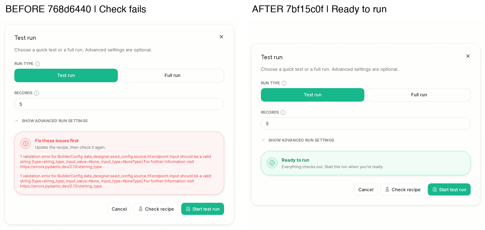

# PR 11300: HF recipe endpoint validation

Upstream: https://github.com/unslothai/unsloth/pull/11300

Compared merge base `768d644036a948441ba80b626c9e747c1fecfbae` with head `7bf15c0fa42c78d8b6f1c547c7ccc84331e7ffd4`.

The same Chromium scene opened Data Recipes, imported a recipe with the public `lhoestq/demo1` CSV seed, opened Run, and clicked Check recipe. Both browsers submitted `endpoint: null` to the real Studio server. Each side used its own checkout, built frontend, home, authentication, cache and port inside a Modal Linux CPU container. Viewport: 1440 × 1000. The composite uses the same fixed crop on both screenshots and preserves original scale.

| Measurement | Before | After |
|---|---|---|
| HTTP status | 200 | 200 |
| Submitted endpoint | null | null |
| Validation valid | false | true |
| Validation error count | 1 | 0 |
| Visible result | Fix these issues first | Ready to run |

The after-side backend probe fetched the real 5-row public HF dataset and generated exactly 2 rows, each with `result=verified`. No model inference or provider key was required. All 21 recipe seed tests passed in Modal. The check did not mock `validate_recipe` or the Hugging Face reader.

Codex approved this exact head: https://github.com/NilayYadav/unsloth-staging/pull/140#issuecomment-5745804609

GitHub Actions A/B proof before the rebase: https://github.com/NilayYadav/unsloth-staging/actions/runs/35454417171
- Before (`ef00d4946`): failed at the intended endpoint validation assertion.
- After (`78f8e8171`): passed real validation and two-row generation; 20 seed tests passed and one optional plugin case skipped.
- The production fix and its test are unchanged by the rebase. The current head was reverified above in Modal with all 21 cases passing.
- Current-head Actions refresh: https://github.com/NilayYadav/unsloth-staging/actions/runs/35473562897 (queued at publication).

Full measurements: [meta.json](meta.json). The image was visually inspected and the byte/fact sameness guards passed. These artifacts contain no credentials or authentication state.
